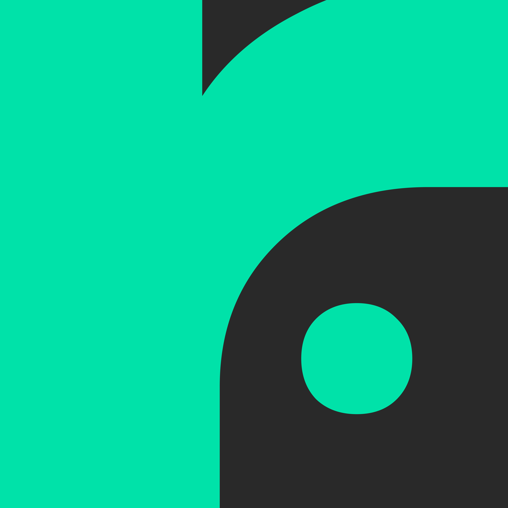
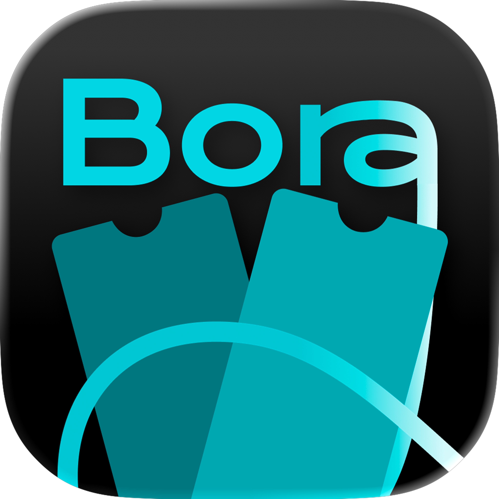
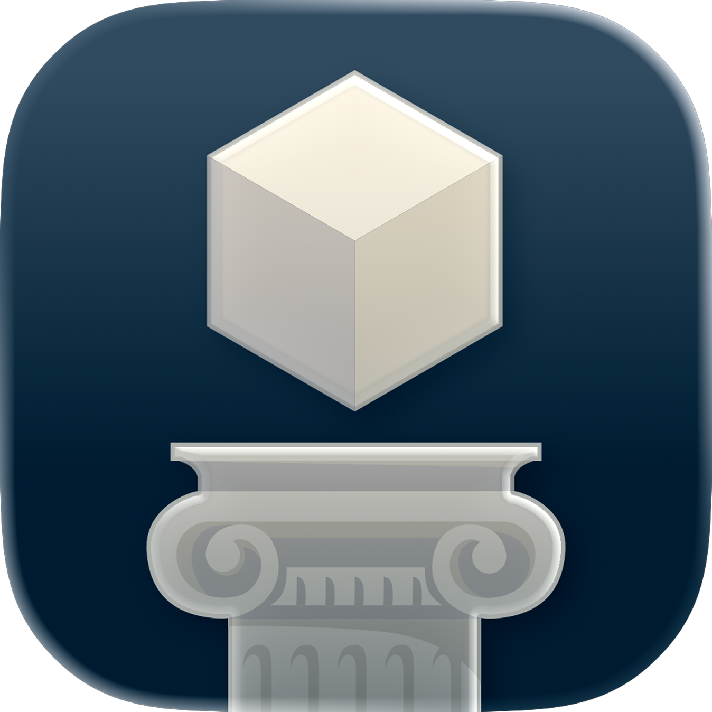

# Eduardo Camana 👋
Desenvolvedor focado em **iOS (Swift / SwiftUI)** e construção de produtos. Curto criar apps com boa experiência, arquitetura organizada e integrações reais (APIs, persistência, Apple ecosystem, etc.).

📍 Brasil • 🎓 Engenharia de Software (PUCRS) • 🍎 Apple Developer Academy

---

## 🚀 Tech Stack
**Mobile:** Swift • SwiftUI • UIKit • XCTest / XCUITest  
**Apple:** ARKit • RealityKit • CloudKit • Apple Music (integrações)  
**Web:** React • TypeScript • Tailwind  
**Backend:** Node.js • NestJS • REST APIs  
**Outros:** Git/GitHub • Figma • Arquitetura limpa • SOLID

---

## 📱 Apps on the App Store

<table width="100%" cellspacing="0" cellpadding="14">
<tr>
<td width="33%" align="center" valign="top">
  
    
  <strong>Recorda.</strong>
   
  Recorde histórias com álbuns.
    
  <a href="https://apps.apple.com/br/app/recorda/id6747271327">View on App Store →</a>
</td>
<td width="33%" align="center" valign="top">
  
    
  <strong>Boraa</strong>
   
  Descubra rolês e recomendações com amigos.
    
  <a href="https://apps.apple.com/br/app/boraa/id6752790553">View on App Store →</a>
</td>
<td width="33%" align="center" valign="top">
  
    
  <strong>Glyptis</strong>
   
  Realidade esculpida.
    
  <a href="https://apps.apple.com/br/app/glyptis-realidade-esculpida/id6755839447">View on App Store →</a>
</td>
</tr>
</table>

---
<!--

## 📊 GitHub stats

  

---
-->

## 🌐 Contact

  
  
  
  

